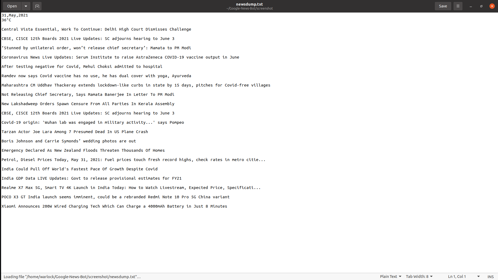

# Google-News-Bot
Google News Bot using Web Scraper in Python using Selenium 

This is a bot which can fetch:
1. Top Headlines 
3. Date and Weather of current location  
2. Search particular query
 

## Usage: 
For fetching top headlines:
> python3 newsBot.py 

For fetching news for particular query:
> python3 newsBot.py < searchquery >

The script runs and a text file(<b>newsdump.txt</b>) is written in the same directory. 
 

## Screenshot 
Fetching Top Headlines 

 Searching for "covid" 

 

## Requirements:
Basic requirements: 
1. Python 3.5 above  
2. Text editor(eg. gedit)
3. Firefox Browser 
  

> python3 -m pip install -r requirements.txt
 

## Acknowledgement:
<a href="https://news.google.com/">Google News</a>

